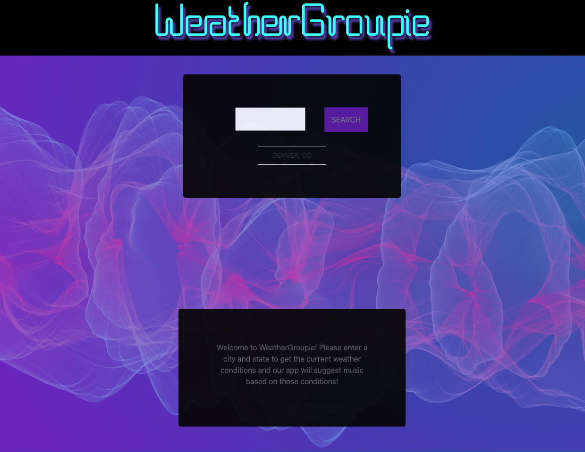
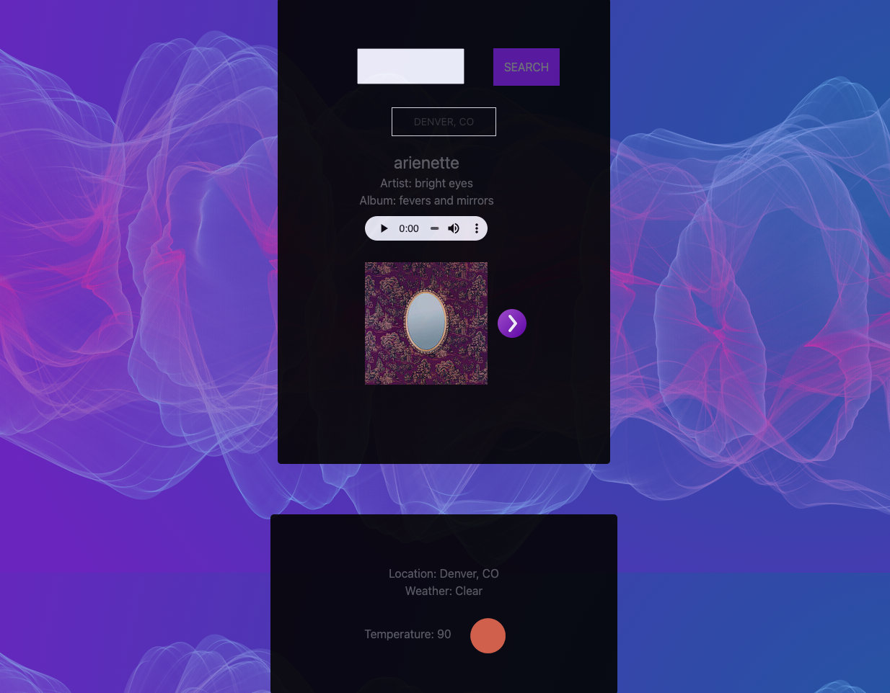
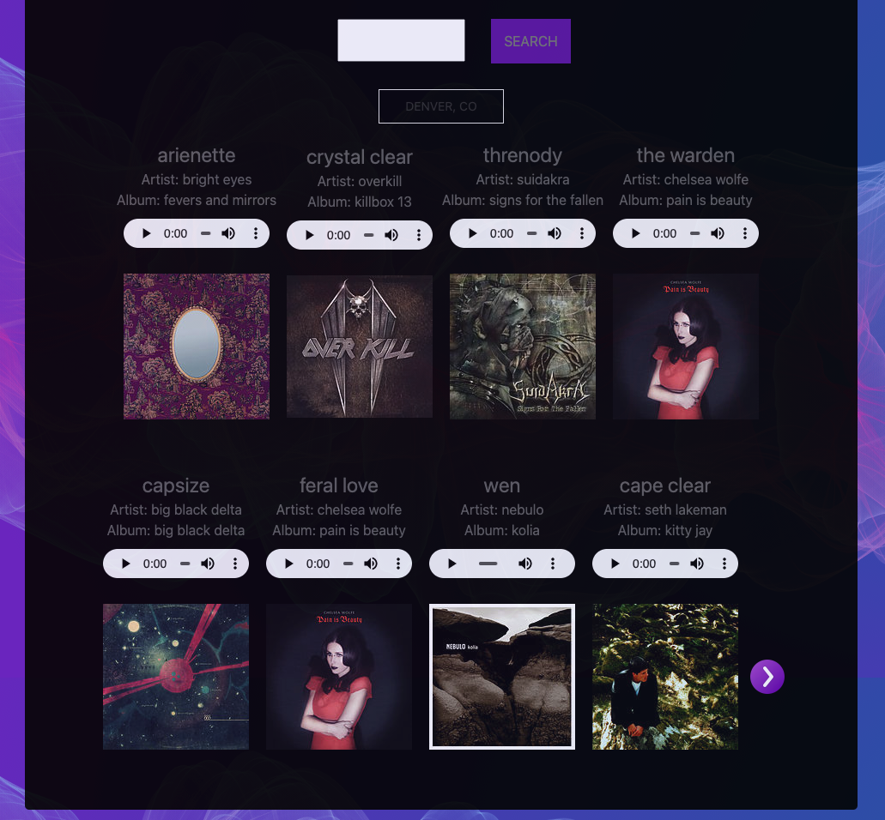

  # WeatherGroupie2.0

  ## Description 

  WeatherGroupie2.0 is an revised version of WeatherGroupie. The app asks a for a user to input a city and state code so that third party API calls may be made to get the local weather in that area, then use those conditions to search and select music based on those conditions.

  here is a link to my project.
  
  * [link](https://0blockaye0.github.io/WeatherGroupie2.0/)

  ## Table of Contents

  * [Installation](#installation)
  * [Usage](#usage)
  * [Credits](#credits)
  * [License](#license)
  * [features](#features)
  * [tests](#tests)
  * [contributing](#contributing)
  * [questions](#questions)
  

  ## Installation

  No installation is required.

  ## Usage

  As a user, I would like music that is just right for the weather in my area. 

   

   When I search the WeatherGroupie2.0 App, I am given a sample of music that is recommended based on the current conditions.

  

   I may skip to the next track if I would like, and the previous tracks will stay on the page.

  

  ## Credits
  Inherited contributors from the original WeatherGroupie are [cooperrc1](https://github.com/cooperrc1) & [Pmarti53](https://github.com/Pmarti53)

  ## License

  * 

  ## Badges
  
   
   

  ## Features

  The Next track Button was just added to provide a better UX by allowing more activity between user and application. This also created an oppurtunity to use more than just one of the tracks from the data collected by the API calls, as well as cut down on repeated tracks. 

  ## Future Developments

  1. I would like to use temperature, wind-speeds, daylight/time, and other weather/enviromental conditions to help search for music to recommend. 
  2.  Add async functionality to improve preformance and UX. 
  3. More error handling.
  4. Improve audio controls styling.
  5. Add ability to save tracks to a playlist.
  6. Find ways to use a larger data-set to avoid repeated tracks.

  ## Contributing

  If you would like to contribute in any way, please contact me through the links provided below.

  ## Questions

  If you have any questions about the app, 
  please feel free to contact me via email, 
  or checkout my Github account for more 
  great projects! 

  * [Email](mailto:blake.austin.dev@gmail.com)
  * [Github](https://github.com/0blockaye0)

